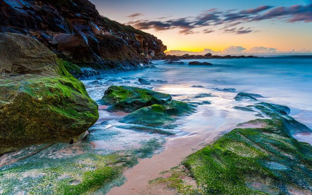

# How to edit your photo or image programmatically

## Intro

In real life, we pay attention to colorful images, and in the virtual world, our perception inevitably reacts to a beautiful picture. The more attractive the shop window, the more likely we will go into the store itself; how the more interesting the visual content of the site, whether it is an online store or a thematic blog, the higher its traffic. However, the search and integration of engaging pictures is only part of the task facing the author, who forms the visual approach of the page. The next, and no less important step is editing of pictures. Properly edited photos - the same quality mark of the site as its text content. It increases website attractiveness, and user conversion rate, as a result creating new business opportunities for commercial sites and raising the recognition of researchers. The program library for photo editing is intended to facilitate the rapid development of new applications and services.

Editing pictures is a frequent task for developers, researchers and students. Automatic editing of images helps to prepare initial raw photos for further processing. With programmable image processing, you can easily not only edit a photo but edit many photos at once. Tasks with editing of pictures are usually repeated and by using an image manipulation library you can significantly improve your performance. This process can be automatically done by using Aspose.Imaging program library. With the program library, it's easy to manipulate massively with a bunch of files. For example, repeat several operations sequences with images: image resizing, cropping, rotating and applying filters before publication on a website. Another popular case for programable image editing is creating a web service or custom standalone application for particular operations with images such are drawing text on images, removing the background or adjusting image parameters.

In this article, we consider how to use the most demanded operations for image editing with Aspose.Imaging C# library:

- [Resize](#resizing-an-image)
- [Crop](#crop-an-image)
- [Rotate](#rotate)
- [Remove background](#remove-background)
- [Filter](#filter-an-image)
- [Merge](#merge-images)
- [Grayscale](#grayscale-image)
- [Binarize](#binarize-image)
- [Dither](#dither-image)
- [Adjust](#adjust-image)
- [Cartoonify](#cartoonify-image)
- [Drawing images](#drawing-images)
- [Online editor](#how-to-edit-your-photo-or-image-online)

Please follow the link to see the table with the list of all supported image formats -> [supported-file-formats](https://docs.aspose.com/imaging/net/supported-file-formats/)

## Resizing an image

Usually, resizing an image is necessary when initial images have different sizes and don’t suit our demands. It's impossible to publish on a website some images because of its high resolution or very large sizes. Also often we need to create a set of images with different sizes: small, medium and extra large for different views, such are thumbnails for preview or detailed views. The Aspose.Imaging library helps you to create a C# application and do this picture resizer job or photo resizing automatically. The library already has all the necessary tools to edit an image size. You just need to indicate what photo sizing you want to finally have, load initial images to the memory cache, apply the resize method and save the resulting image file to a new location.

C# code example to resize an image:
[howto-resize-image](howto_resize_image.md)

## Crop an image

Another widely used operation of edit an image is image cropping. If an image or photo has unwanted fields on the sides you need to cut it off. Also, you may want to crop a dedicated rectangle area of the photo. For example, the interesting area is located on some part of the whole image and you want to cut off only this particular piece. You can execute both types of cropping: image crop by shifts and image crop by a rectangle by using Aspose.Imaging. In the first case, you indicate the shifts from sides, in the second - the rectangle area to crop photo.

C# code example to crop an image:
[howto-crop-image](howto_crop_image.md)

## Rotate

Original photos may have the wrong orientation due to a photographer had took photo shots with various camera rotations and embedded auto-rotation does not work properly. The information about picture orientation is usually written down in the image `EXIF` metadata by camera software and used for rotation. You can rotate images programmable by 90/180/270-degree angles or flip photos vertically or horizontally to fix this issue. In some cases, the photos were made with a mistake of horizon slop, the horizon line has not strongly horizontal. The program library gives you the possibility to rotate an image on a specific angle as well.

C# code example to rotate an image:
[howto-rotate-image](howto_rotate_image.md)

The more detailed description of resize, crop and rotate operations you can find in the official documentation [link](https://docs.aspose.com/imaging/net/crop-rotate-and-resize-images/).

## Remove background

Sometimes you need to remove a background from a photo and leave only human’s figures or other objects on a white field. Removing a picture background or photo background change are more complicated tasks than the basic image manipulations mentioned above. With Aspose.Imaging library you can effectively remove or change a photo background and embeds the library into your photo background editor application. The image library can automatically mask background pixels and set them to zero (white color) or another color. Additionally Imaging.Cloud API can be used for improving masking results. The Cloud API is used for detecting objects on a photo and applying detected objects’ bounds to the image more precisely.

Original image:

Image with removed background:

C# code example for removing image background:
[howto-remove-background](howto_remove_background.md)

## Filter an image

Applying filters to images is a very popular operation of image quality enhancement. You may need to filter photo to make it more sharp or on the contrary, blur them. You can quickly apply several filters using the C# program. Aspose.Imaging proposes a list of available filters for smoothing images with noise reduction, but preserving objects’ edges, changing brightness and contrast for reducing overexposure of photography or lightening too dark parts, and emphasizing details.

C# code example for image filtering:
[howto-filter-image](howto_filter_image.md)

## Merge images

To combine several images into one image you can use methods from the image library. It is possible to merge images by adding them to the resulting image in horizontal or vertical directions. This approach is suitable for creating large images, like wallpaper, consisting of many repeated small ones or you can create a collage from several different images.

Example C# code to merge images:
[howto-merge-images](./howto_merge_images.md)

## Grayscale image

Some images may look more interesting in grayscale format rather than in color. The colors in photography may not contain valuable information, but a black&white style could emphasize lights and shadows, attract attention to surface details, and create more emotional responses. The `Grayscale` method of Aspose.Imaging converts color images to it grayscale representation.

Grayscaled image example:

C# code example to convert image to grayscale:
[howto-grayscale-image](./howto_grayscale_image.md)

## Binarize image

Another technique to convert color images to black and white is to binarize them. It means that each pixel of the image will be substituted to value 0 or 1 (white or black color) depending on the indicated threshold. The binarization useful for printing pictures in one black color without tint graduation. With the image library, you can select between fixed thresholds, use the average threshold value calculated from the neighbor pixels area with the `Bradley` method or automatically choice a threshold with the `Otsu` method.

Original image:

Example of black and image with binarization threshold 100:

C# code example to binarize image:
[howto-binarize-image](./howto_binarize_image.md)

## Dither image

Image dithering is used for adding some noise to pictures. This method can increase image quality after reducing the color palette for publishing on the web and creating a trilling visual effect. With the Aspose image library, you use the simple `Threshold` method or the more complex `FloydSteinberg` method, which uses nearest neighbors’ pixels intensity values for dithering.

Example of image with `FloydSteinberg` dither method applied:

C# code example to dither image:
[howto-dither-image](./howto_dither_image.md)

## Adjust image

Adjusting image brightness, contrast and gamma are often used operations for image editing before publishing. Pictures may look pale or different areas of the image could be too darkened or too lighten without properly adjusting these parameters. These image defects lead to picture details loss and the general effect of a website with such images will be weak. You can perform brightness, contrast or gamma correction by passing appropriate parameters to the image library method.

C# code examples:
[howto-adjust-image](./howto_adjust_image.md)

## Cartoonify image

Also, you can combine several image editing techniques and create new sophisticated visual effects, for example, the effect of a cartoon image. Cartoon-style images will decorate your publication and attract more users. The example below sequentially uses a list of methods such as `AdjustBrightness`, `BinarizeFixed`, `Filter`, `ReplaceColor`, `ApplyMask` and others applied to the original loaded images.

Example of image with `Cartoonify` filter applied:

C# code example:
[howto-cartoonify-image](./howto_cartoonify_image.md)

## Drawing images

You can not only edit existing images but create new ones and draw various shapes such as Lines, Ellipses, Rectangles, Arcs and Bezier shapes. First, you need to create an image surface with selected background color, then select a tool Pen to draw with a specific brush, color and width.

C# code examples:
[howto-drawing-images](./howto_draw_image.md)

## How to edit your photo or image online

Finally, if you would like to try a demo you can edit your pictures online. With an online image editor, it is possible to make all common operations with your images. Open [Online image editor](https://products.aspose.app/imaging/image-editor) in your browser and upload your image file from a local PC by drag-and-drop or upload an image from your Google or DropBox account into an active image editor area in your browser window. In the online editor, you can crop the image by selecting an arbitrary rectangle area or by selecting an area with a predefined sides ratio. Also, you can resize an image and rotate or flip it. There are dozen of filters available for online photo editing, including adjusting Brightness and Contrast, Gamma corrections, Grayscale, Binarize, Blur, Sharpen and Cartoon filters: [Online photo editor](https://products.aspose.app/imaging/photo-filter). After editing the image and applying filters you can save the results using 20 available different image formats. You can use Aspose online photo editing app as a free photo editor.

## Conclusion

Aspose.Imaging program library helps you to edit images and photos and facilitates the development of graphic manipulating applications and services. The image library provides you ready to use program methods to process images in your own way. Free online photo and images editor with photo filter is available at your convenience where you can try the most popular image editing operations and save the results in many image formats.
